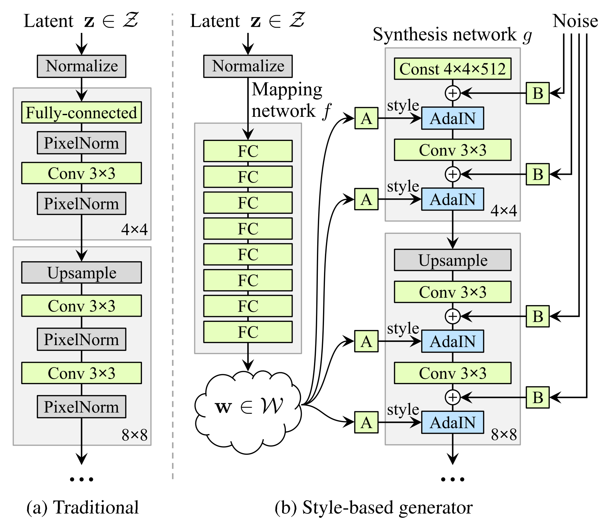
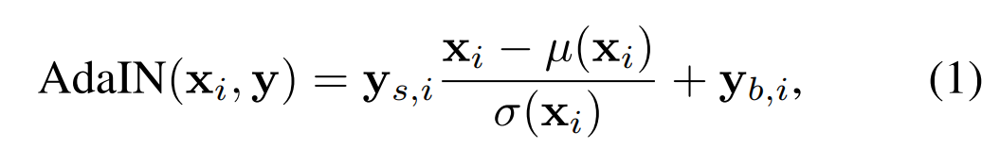
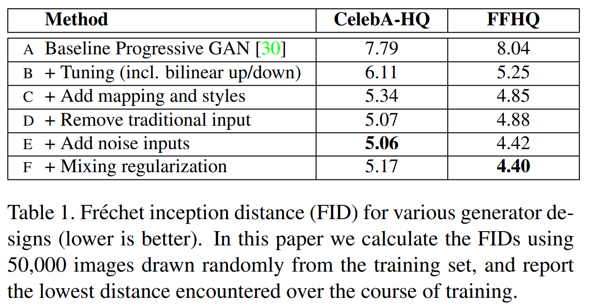

# A Style-Based Generator Architecture for Generative Adversarial Networks (StyleGAN)  

## Abstract  

기존 GAN 기반의 Style tranfer task에서 Generator의 구조를 변형하여 좋은 결과를 보여줬다.  
(포즈, 얼굴의 특징 같은 것을 잘 학습한다.)  
latent factor의 변화 분석, distribution quality metrics에 대한 Generator의 성능 향상이 가능했다.  
논문에서는 이러한 성능향상을 위해, 모든 Generator Architecture에 적용할 수 있는 두가지 방법을 제안한다.  

## 1. Introduction  

최근들어 image generation task는 Generative Adversarial Network를 통해 큰 발전을 했지만, GAN의 Generator는 BlackBox 모델이며 Stochastic feature에 대한 이해가 부족하다.  

따라서 Style Tranfer를 제어할 수 있도록 Generator를 새롭게 설계했다. Discriminator와 loss function은 따로 건들이지 않있다.  
또한 논문에서는 input latent space는 train data에 대한 확률 밀도를 따르고 피할 수 없이 얽히게 된다고 주장한다.  
이전의 latent space 상의 관계를 추정하는 벙법은 쓸수 없기 때문에, 이를 측정하기 위한 metric인 Paerceptual path length와 linear separability를 제안한다.  
이를통해, 기존의 Generator 구조와 비교하여 더 선형적이고 더 분리된 표현이 가능하다.  

그리고 기존의 고해상도의 얼굴 데이터셋보다 더 높은 품질과 다양성을 제공해주는 데이터셋인 FFHQ를 제시한다.  

### 요약  
> 새로운 Generator구조와 latent space에 대한 정확한 이해를 통해 각 특징에 대한 분리를 더 잘 하기 위한 2가지의 metric을 제시하고 이전보다 좋은 품질의 고해상도 얼굴 데이터셋 FFHQ에 대한 소개  

## 2. Style-based Generator  

일반적으로 latent code는 Generator(feed-froward network)의 입력 계층에 전달된다.  
StyleGAN은 여기서 입력 레이어를 없애버리고 아래 그림처럼 학습된 Constant layer에서 시작할수 있도록 만들었다.(Constant layer란 상수로 이루어진 레이어를 뜻한다.)  

  

입력 latent code인 z가 latent space Z에서 주어지면, non-linear mapping newtork인 f: Z->W가 w를 생성해낸다.  
각각에 대한 차원수는 512개로, mapping network f는 8개의 multi-layer perceptron으로 구성된다.  
이렇게 만들어진 intermediate latent space W는 Synthesis network g의 중간중간에 삽입될 latent space로써 AdaIN을 통해 각 convolution layer에 들어간다.  
Gausian noise는 convolution 이후에 네트워크에 삽입된다.  
f와 g는 각 8개, 18개의 네트워크로 구성되어 있는데 block 단위로 4^2 ~ 1024^2 까지의 resolution에 대해 관여한다.  

다시 w로 돌아가서, 학습된 아핀 transformation은 (그림에서의 A부분) adaptive instance normalization(AdaIN)을 조정해 $y = (y_s, y_b)$의 스타일로 w를 가공한다.  
이것을 Synthesis network g의 각 convolution layer의 뒤에 삽입한다.  

  

feature map $x_i$는 정규화된 style y의 구성요소인 $y_s, y_b$를 통해 변형된다. 따라서 y의 차원수는 해당 layer의 feature map 크기의 2배이다.  

정리하자면 latent vector w에서 공간상 변화하지 않는 style y를 뽑아내 convolution된 feature에 적용하는 것이다.  
다른 일반적인 transforms task와 비교했을 때 adaIN이 효율적이고 간결하다고 한다.  

마지막으로 noise를 통해 stochastic detail을 generator에 적용할 수 있도록 한다. noise는 서로 상관 관계가 없는 가우시안 noise로 구성된 single-channel 이미지이며 각 계층마다 전용 noise를 공급한다.  
noise는 학습된 scaling factor를 통해 각 feature map에 브로드캐스트되며, convolution의 출력에 추가된다.  

### 요약
> 새로운 Generator는 Mapping network f와 Synthesis network g로 구분되고 g는 기존처럼 latent space를 입력으로 두지 않는 대신 constant tensor를 입력으로 받는다. latent space는 f를 통해 intermediate latent space w로 변환되고 adaIN을 통해 g의 중간 중간 layer에 입력된다. 마찬가지로 noise를 중간중간 입력으로 받아온다. 여기서 w는 생성하는 이미지에 스타일을, noise는 스타일에 대한 디테일을 관장한다.  

### 2.1 Quality of generated images  

Generator에 대한 여러 실험 끝에 generator의 구조를 재설계하는 것은 이미지 quality를 개선하는데에 도움이 된다는 것을 알게 되었다.  

  

먼저 bilinear up/downsampling, 더 긴 학습, 하이퍼파라미터 튜닝을 사용했다.  그리고 mapping network, AdaIN을 추가했다. 여기서 첫번째 convolution layer에 latent code를 넣는 것이 효과적이지 못하다는 것을 알게되었다.  
따라서 기존 입력 계층을 제거하고 4x4x512의 constant tensor를 시작으로 이미지를 생성하도록 했다. 네트워크가 AdaIN을 통해서만 style을 제어함에도 불구하고 의미있는 결과를 생성이 가능했다.  

noise의 입력을 통해 결과를 더 개선하고, novel mixing regularization을 통해 세밀하게 제어가 가능해졌다.  

Style 기반의 Generator는 기존에 비해서 FID를 거의 20% 향상시켰다.  

(여기서 FID란? https://m.blog.naver.com/chrhdhkd/222013835684) -> GAN의 품질 평가지표  

