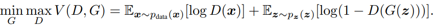

# Generative Adversarial Net

## Abstract

두가지 모델을 동시에 훈련하는 적대적(Adversarial) 프로세스를 통해 생성 모델을 훈련시키기 위한 새로운 프레임워크를 제안한다.  
모델은 G(generative)와 D(discriminative)가 있는데, G는 훈련을 통해 D가 실수할 확률 (잘못 분류할 확률)을 최대화한다.  
마치 2명이서 minimax 게임을 하는것과 비슷하다.  

## 1 Introduction  

지금까지 딥러닝을 이용한 가장 두드러진 성과는 클래스 라벨을 매칭하는 모델들이였다. (classification등의 모델을 말하는 듯)  
이같은 성공은 보통 역전파 알고리즘과 드롭아웃을 기반으로, 특히 좋은 기울기를 가진 선형 모델에서 작동했다.  
그러나 생성적(generative) 모델은 곤사화가 어렵고, 선형적인 모델의 이점을 받기 어려워 좋은 결과를 내지 못하였다.  
우리는 이같은 어려움을 해소하는 새로운 생성 모델을 제안한다.  

## 3 Adversarial Nets

적대적(Adversarial) 모델링 프레임 워크는 모델이 모두 다층 퍼셉트론(MLP)일 때 쉽게 적용이 가능하다.  
학습 초반에는 G가 생성한 이미지는 D가 G가 생성한 가짜인지 진짜인지 바로 구별할 수 있을 정도로 형편 없어 D(G(z))는 0에 가깝다.  
학습이 진행될수록, G는 실제 데이터의 분포를 모사하여  D(G(z))의 값이 1이 되도록 발전한다.  
수식으로 표현하면 다음과 같다. 

  

    - D가 매우 잘 판단했을 때, 이상적으로 얻을수 있는 최대 결과 = 0
    - G가 매우 진짜같은 데이터를 생성했을 때, 이상적으로 얻을 수 있는 최대 결과 = -무한대

결론적으로 D는 V(D,G)를 최대화하려하고, G는 V(D,G)를 최소화 하는것이 목적이다. 논문에서는 이를 two-player minimax game으로 표현했다.  
