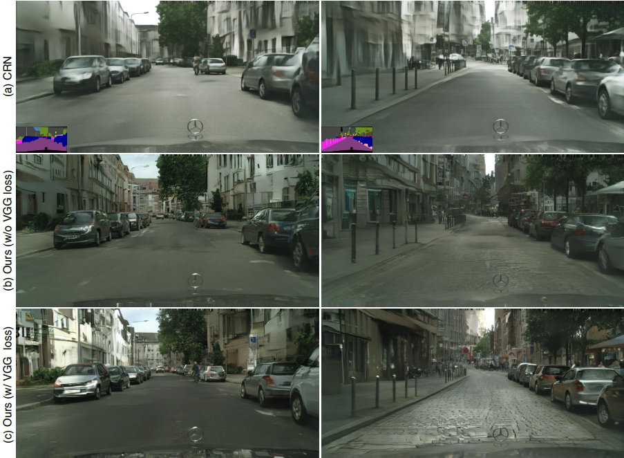

# High-Resolution Images Synthesis and Semantic Manipulation with Conditional GANs (Pix2PixHD)  

Image-to-Image Translation with Conditional Adversarial Networks(Pix2Pix)의 후속논문으로 UC Berkeley와 NVIDIA에서 작성한 논문이다.  

## Abstract  

이 논문은 conditional GAN을 통해 높은 해상도(high resolution)의 semantic label map을 realistic한 이미지로 생성했다고 한다.  
conditional GAN은 높은 해상도에서 사용하기 힘들었는데 새로운 multi-scale Generator와 Discriminator + 새로운 Adversarial loss를 사용해 2048 x 1024의 사이즈로 괜찮은 결과를 뽑아냈다.  

그리고 두가지의 추가적인 기능을 통해 **interactive visual manipulation**으로 확장하는데 이는 다음과 같다.  

    1. object manipulation이 가능한 객체 segmentation information을 통합한다.  
    2. 동일 입력에 대한 다양한 결과를 생성해 사용자가 객채의 모양을 편집할 수 있도록 한다.  

이를 통해 image synthesis 품질과 해상도를 향상시켰다.  

## 1. Introduction  

논문에서는 앞서 설명했듯 sementic label map을 통해 높은 해상도의 realistic 한 이미지를 생성했다. 그리고 여기서 사용된 메소드는 응용할 수 있는 범위가 넓다.  

이를 위해서는 image-to-image translation에서 사용되는 (conditional GAN을 활용하는) Pix2Pix 방법을 사용한다. 다만 Pix2Pix는 높은 해상도의 작업에서는 좋은 결과물을 보여주지 못했다고 한다.  
따라서 질감과 미세한 디테일을 살리기 위해 Perceptual Loss를 사용한다.

일단 처음에는 따로 pre trained network, Perceptual loss 등 추가적인 것 들을 사용하지 않고 adversarial training만을 진행한다.  
다음으로 만약 pretrained network가 있다면 pretrained 된 네트워크의 perceptual loss를 추가하여 결과를 좀더 개선할 수 있다.  

  
  

또한 Abstract에서 언급한 것처럼 상호 semantic manipulation을 지원하기위해서 두가지의 방법을 사용했다.

    1. instance level의 객체 segmentation 정보를 이용해서 동일한 범주에서 서로 다른 객체를 분리할수 있다.
        - 이를 이용해 객체를 추가/제거하거나 객체의 유형을 변경할 수 있다고 한다.
    2. 동일 입력 label에 대해 디양한 결과를 생성해 사용자가 객체의 모양을 상호적으로 편집할 수 있도록 한다.  

  

## 2. Related Work  

### Generative Adversarial networks
생략  

### Image-to-Image translation  
생략

### Deep visual manipulation

근 몇년간 Deep Neural network(DNN)는 image processing task에서 좋은 결과를 보여왔다. (Inpainting, Colorization, Restoration ...)  
그러나 출력 공간 탐색, 결과 조정등을 하기에는 인터페이스가 딱히 없었다..  
이에 따라 몇가지 연구들이 생겨나게되었고, 빠르게 장면을 생성할수 있게 되었다.  

## 3. Instance-Level Image Synthesis  

베이스 모델은 이름처럼 Pix2Pix 모델을 사용했다.  
여기에 목적함수와 네트워크 디자인을 개선하여 더 높은 resolution 및 실제같은 사진을 만든다.  
그리고 추가적인 *instance-level object semantic information*을 사용하여 품질을 더 개선한다.  
마지막으로 instance-level의 feature를 임베딩하는 체계를 도입해서 multi-modal image synthesis를 더 잘 처리하게 한다.  

### 3.1. The pix2pix Baseline  

Pix2Pix는 GAN으로 Generator G와 Discriminator D를 가지고 있다. 
G는 semantic label map을 ralistic한 이미지로 변환하고 D는 실제 이미지와 G에서 생성된 이미지를 비교하는 역할을 수행한다.  
여기서 Pair data로 {[si, xi]}가 주어진다. (si: semantic label map, xi: 실제 사진)  
Conditional GAN은 다음과 같은 minimax game을 통해 semantic label map이 실제 이미지의 조건 분포를 모델링하는것을 목표로 한다.  
(말이 어려운데, 아무래도 minimax game을 통해 실제 이미지로 translation 하는것을 잘 학습하는거를 목표로 한다는 것 같다.)  

  

Pix2Pix는 최대 256 x 256의 이미지를 생성한다. 더 높은 해상되에서는 학습이 불안정하고 품질이 좋지 않다고 한다.  
이를 개선하기 위한 솔루션을 아래에 소개했다.  

### 3.2. Improving Photorealism and Resolution  

Pix2Pix 네트워크의 개선에 사용한 솔루션은 3가지이다.  

    1. Coarse-tofine generator
    2. multi-scale discriminator architecture  
    3. robust adversarial learning objective function  

***Coarse-tofine generator***  

Coarse-tofine generator는 Generator를 하위 네트워크 2개(G1, G2)로 분해한 것이다.  

* G1: Global Generator Network (생성 네트워크)
* G2: Local Enhancer Network (강화 네트워크)  

발전기 G={G1, G2}는 다음과 같이 주어진다.  

  

(먼저 resolution이 적은 이미지를 G1이 훈련하고, G2가 G1에 추가되어 고해상도 이미지에 대해 같이 훈련한다. 특히 G2의 Residual block의 입력은 G2의 feature map과 G1의 마지막 feature map의 요소 합이다.)  

Global Generator network는 1024 x 512 해상도에서 작동하고 Local Enhancer Network는 이전 출력 크기의 4배 (가로 2배, 세로 2배)의 해상도로 이미지를 출력한다.  
더 높은 해상도의 이미지 합성을 위해서 추가적인 Local Enhancer Network를 