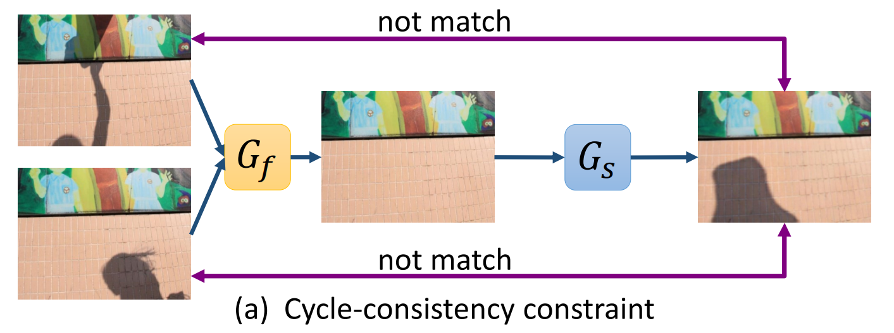
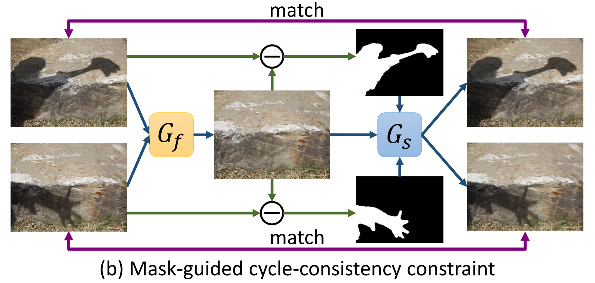
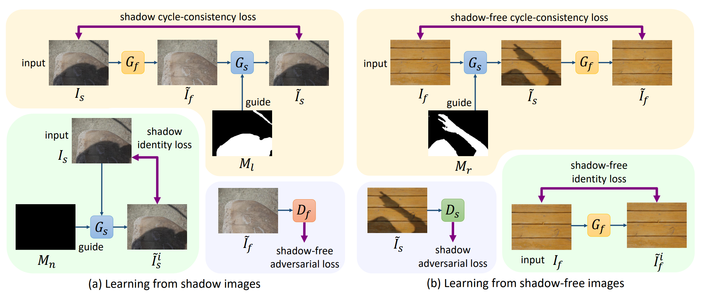
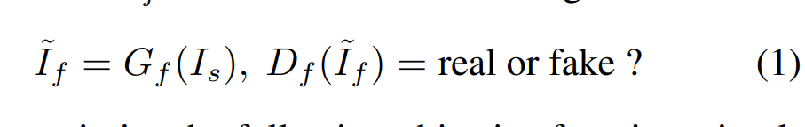
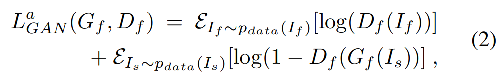
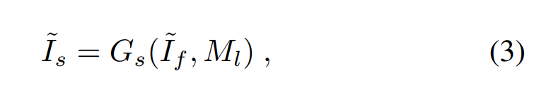
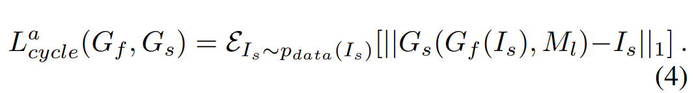
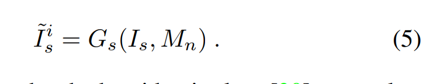
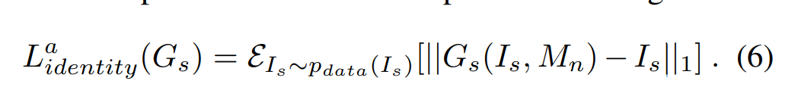

# Mask-ShadowGAN: Learning to Remove Shadows from Unpaired Data  

## Introduction  

Shadow removal problem은 빛의 광량이나 그림자의 크기 및 모양이 각각 다르기 때문에 기존의 머신러닝 알고리즘을 이용하기에는 한계가 있다.  
또한 Paired data를 모으기가 어렵다.  

그래서  저자는 CycleGAN 처럼 unpaired data를 이용해 그림자를 제거하는 방법을 고안했다.  
여기서 Gf를 통해 그림자를 없애고 Gs를 통해 다시 그림자를 생성하는 방식을 사용했다. ('**원본 이미지 = Gs(Gf(원본이미지))**')  

여기서 문제점이 하나 존재하는데, 딥러닝 모델은 같은 입력에 대해서 항상 같은 출력을 가진다.  
그러나 그림자는 같은 배경에서 다른 그림자들이 만들어질 수 있으므로 이러한 방식은 적합하지 못하다.  
(Gf를 통해 그림자가 제거된 이미지를 GS에 넣을 경우, 원본 이미지를 생성할 수 없기 때문에 CycleGAN만 이용해서 그림자를 제거하기 쉽지 않음)  

  

그래서 저자가 제시한 방법은, 그림자 이미지에서 그림자 마스크 이미지를 생성하고 이것을 이용해 Gs가 제대로 된 그림자 이미지를 생성할 수 있도록 하는 것이다. (Mask-ShadowGAN)  

  

## 2. Related Work

### 2.1 Shadow Removal  

 처음에는 색을 바꾼다던가 하는 원시적인 방법을 사용 -> 베이지안 모델 사용 -> CNN (Paired Data)를 사용 ...

## 3. Methodology  

  

(a)는 Shadow image를 통해 학습하고 (b)는 Shadow-free image를 통해 학습한다.  
Loss는 Cycle-consistency loss(노랑), identity loss(초록), adversarial loss(파랑)의 3가지를 사용했다.  

(여기서 identity loss는 색감 등을 보조해주는 loss로써, L1 Loss와 연관이 있다. CycleGAN은 직접적인 pair data가 없어 L1 Loss 사용이 불가능하지만 생성 이미지를 이용해서 간접적으로 Generator에 loss를 적용한 듯하다. 자세한 내용은 CycleGAN 참조)  

### 3.1 Learning from shadow Images  

먼저 원본 그림자 이미지 Is에 Gf를 통해 그림자를 제거한 뒤, Df를 통해 실제 그림자가 없는 이미지인지 판단한다.  

  
  

E(입실론)은 error를 뜻한다고 한다.  
Adversarial Loss 만으로는 과적합 될 수 있으므로, Cycle consistency를 적용한다.  
이 때, 앞서 말한 것처럼 Shadow free image(If)에 Mask image라는 가이드라인을 합쳐야지 이미지 복원이 가능하다.  

  

여기서 Mask image인 Ml은 원본 그림자 이미지와 Gf를 통해 만들어진 Shadow free image의 차이다.  
그리고 Gs와 Gf의 mapping 함수를 최적화 하기위한 Cycle consistency loss를 적용하면 다음과 같아진다.  

  

그리고 L1 loss를 통해 Mask image와 Shadow image 사이의 관계를 학습할 수 있다.  

  

또한 Identity Loss는 입력을 출력 이미지와 비슷하게 정규화 해준다.(색상 등도 보존된다.)   

  

### 3.2 Learning from Shadow-free Images  

