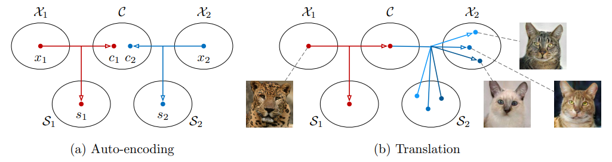
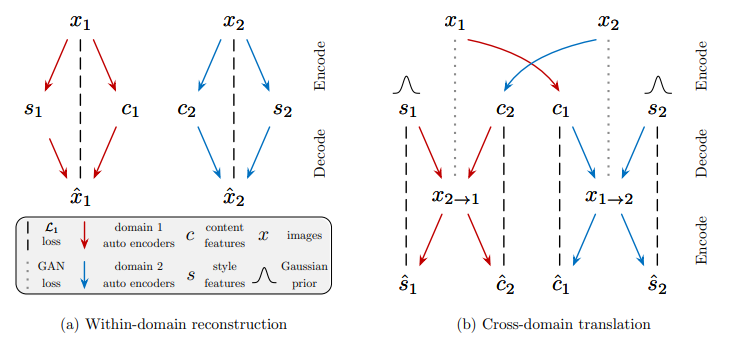
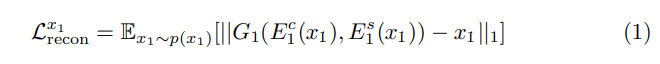
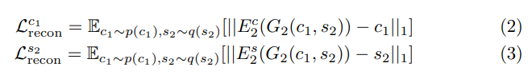

# Multimodal Unsupervised Image-to-Image Translation (MUNIT)  

2018년 NVIDIA에서 발표한 Image-to-Image translation 논문이다.  

## Abstract  

Unsupervised Image-to-Image Translation은 이미지 pair에 대한 학습이 아닌 해당 이미지의 도메인에대한 조건부 분포를 학습한다.  
기본적으로 multimodal 한 task임에도 불구하고 기존에는 일대일 매핑으로 모델링하여 지나치게 단순화 되었다. 이것은 결과적으로 도메인 이미지에 대한 다양한 출력을 생성하지 못한다.  
논문의 저자는 이미지에 대한 콘텐츠와 스타일은 서로 분해가 가능하다고 가정하고, 대상 도메인의 style space에서 샘플링된 임의의 스타일과 콘텐츠를 재결합하였다.  
또한 사용자가 스타일 이미지 예시를 제공하여 출력 스타일을 제어할수 있도록 했다.  

### 요약  
> 기존의 one-to-one mapping 방식이 아닌 multimodal 한 방식으로 unsupervised image translation을 해보자

---
## 1 Introduction

Image pair dataset이 있을 경우 생성 모델은 conditional model 또는 간단한 regression model을 사용할 것이다.  
그러나 그러한 dataset이 없는경우에는 훨씬더 어려운 작업이 되게 된다.  

많은 경우에 domain mappimg 작업은 multimodal하다. 예를 들어 겨울 이미지는 날씨, 타이밍, 조명 등을 통해 여러가지의 여름 이미지로 변환할수 있다. 하지만 대부분의 연구에서는 deterministic하고 단일 mapping으로 가정한다.  
결과적으로 출력가능한 모든 확률분포에 대한 추정이 불가능하다.  
모델에 noise를 주어 stochastic하게 만든다해도, 네트워크가 이를 무시하는 방법을 학습할 수도 있다. (styleGAN도 NVIDIA에서 나왔는데 왜 이런말을 할까..)  
  
---  
  

(a) Auto-encoding

각 도메인의 이미지 $X_i$는 공유되는 content space C와 각 도메인별 style space $S_i$로 인코딩된다.  

(b) Translation  

X1 이미지를 X2로 변환하기 위해 content를 변환할 대상 style space에 무작위로 재결합한다. 서로 다른 style은 각각 다른 이미지를 출력한다.  

---
따라서 본 논문은 MUNIT 프레임워크를 제안한다.  
먼저 이미지의 latent space는 content space와 style space로 분해할 수 있다고 가정한다. (a)  
이미지를 대상 도메인으로 변환하기 위해 대상 style space의 임의 style과 content 코드를 재결합한다. content는 변환중에 보존되어야하는 정보, style은 변환되는 정보를 나타내게 된다.  
이렇게 다양한 style을 샘플링하여 MUNIT은 multimodal한 출력을 생성할 수 있다.  
또한 생성되는 출력 이미지의 style은 사용자가 제공한 예제 이미지에 의해 제어할 수 있다.  

### 요약
> latent space를 content space와 style space로 분리하고 각 도메인 이미지들을 매핑한다. 이를 통해 content는 보존하고 style을 multimodal하게 변환할 수 있게된다. 츨력 이미지들은 사용자가 제공하는 예제 이미지에 의해 제어된다.  

---
## 2 Related Works  

    - Generative adversarial networks (GAN)
    - Image-to-Image translation
    - Style transfer
    - learning desentangled representations

### GAN
생략  

### Image-to-Image translation  
최근에는 Supervision 없이 task를 수행하려고 하는데 이는 본질적으로 잘못되었고 추가적인 제약들을 필요로 한다. (즉, unsupervise하게 수행하기 위해서는 제약조건들을 넣어야 한다.)  
예를 들어 최근에 가장 인기있는 것은 Cycle consistency loss이다.  
Cycle consistancy는 이미지를 다른 도메인에 변경했다가 다시 되돌릴경우에 원본 이미지가 나타나게 하는 제약이다.  
UNIT 프레임워크는 두 도메인의 이미지가 동일한 latent space에 매핑되도록 공유 latent space를 가정한다.  

대부분의 Image-to-Image translation의 한계점으로 꼽히는 것은 출력의 다양성이 부족하다는 것이다.  
이를 해결하기 위해서 다양한 출력을 낼수 있게 해주는 방법들이 제시 되었지만 하나의 이미지에서 다른 이미지를 무한히 생성해 낼수는 없다.
BycycleGAN에서 제안한 multimodal distribution은 이것이 가능하지만 위에 설명된 다른 것들은 다 Supervise한 모델들이다. 

### Style Transfer  
Style transfer는 이미지의 content를 보존하면서 style을 수정하는 task이다.  

### Learning disentangled representations  
MUNIT은 desentangled representations learning을 사용했다.  
InfoGAN, β-VAE는 unsupervised하게 disentangled representation을 학습했다.  
일부 연구들은 style과 content를 분리하는데에 초점을 맞추고 있다.  

## 3 Multimodal Unsupervised Image-to-image Translation

### 3.1 Assumptions  

$x_1 \in X_1$과 $x_2 \in X_2$의 2가지 서로 다른 도메인의 이미지가 있다.  
Unsupervised image-to-image translation 작업에서는 공통 분포인 $p(x_1, x_2)$을 사용하지 않고 각 분포 $p(x_1)$, $p(x_2)$를 사용하여 샘플을 추출한다. (pair 데이터를 사용하지 않는다는 의미인듯 하다.)  
$p(x_{1->2}|x_1)$과 $p(x_{2->1}|x2)$를 이용하여 $p(x_2|x_1)$과 $p(x_1|x_2)$를 추정하는것이 목표이다. ($x_{1->2}$는 x1을 x2로 변환하여 생성된 샘플을 의미한다.)  

$p(x_{1->2}|x_1)$과 $p(x_{2->1}|x2)$는 복잡하고 multimodal 한 분포를 가진다. 따라서 deterministic한 모델은 잘 작동하지 않는다.  

이같은 문제를 해결하기 위해 부분적으로 공유된 latent space를 가정한다.  
이미지 $x_i \in X_i$는 두 도메인이 공유하는 latent space인 content latent $c \in C$와 개별적인 도메인의 고유한 style $s_i \in S_i$를 가정한다.  

공통 분포의 이미지쌍 $(x_1, x_2)$는 $x_1 = G_1^*(c,s_1)$ $x_2 = G_2^*(c,s_2)$에 의해 생성된다. 그리고 $G_1^*, G_2^*$는 역이되는 인코더 $E_1=(G_1^*)^{-1}, E_2=(G_2^*)^{-1}$를 가지고 있다고 가정한다.  

UNIT의 경우 공유되는 latent space가 완전하지만, MUNIT은 부분적으로 공유하며, style은 각 도메인 별로 구분한다는 다른점을 가진다. 이는 many-to-many task에서 더 합리적이다.  

---
### 3.2 Model  

  

MUNIT은 2가지의 auto-encoder로 구성되며, 각각의 latent code는 content c와 style s로 구성되어 있다. 변환된 이미지는 대상 도메인의 실제 이미지와 구별하지 못하도록 하는 adversarial한 목표 (점선)와 이미지, latent code를 재구성하는 bidirectional reconstruction 목표를 (파선) 통해 모델을 훈련시킨다.  

---
모델의 구조는 마치 UNIT과 비슷하다. 모델은 각 도메인 $X_i$에 대한 encoder $E_i$와 decoder $G_i$로 구성된다.  
그림의 (a)부분과 같이 latent space는 content $c_i$와 style $s_i$로 분해되며 이에대한 공식은 다음과 같이 정의할 수 있다.  S
> $(c_i, s_i) = (E_i^c(x_i),E_i^s(x_i))$  

image-to-image translation은 (b)와 같이 encoder-decoder 쌍을 통해 수행된다.  
예를 들어 $x_1 \in X_1$의 이미지를 $X_2$로 변환하려면 먼저 $c_1=E_1^c(x_1)$을 추S출하고 분포 $q(s_2)$~$N(0,I)$에서 style latent $s_2$를 무작위로 추출한다.  

- Bidirectional reconstruction loss.

    서로 반대인 encoder와 decoder 쌍을 학습하기 위해 image->latent->image and latent -> image -> latent의 모든 방향에서 reconstruction(재구성)을 장려할수 있게 해준다.  

    - Image reconstruction: 데이터 분포에서 샘플링 된 이미지가 encoding 및 decoding 후에 재구성 할수 있게 해줌  
    

    - Latent reconstruction: translation 할 때 latent space 샘플링된 latent code (style 및 content)가 주어지면 decoding 및 encoding 후에 재구성 할수 있게 해줌  
      
    $q(s_2)$는 $N(0, I)$ 확률 분포에서 주어지며 $p(c_1)$는 $c_1=E_1^c(x_1)$와 $x_1$~$p(x_1)$에서 주어지게 된다.  

$L_{recon}^{x2}, L_{recon}^{c2}, L_{recon}^{s1}$는 모두 비슷한 양상으로 정의되고, 선명한 이미지의 출력을 위해 L1 reconstruction loss를 사용한다.  

- Adversarial loss.  