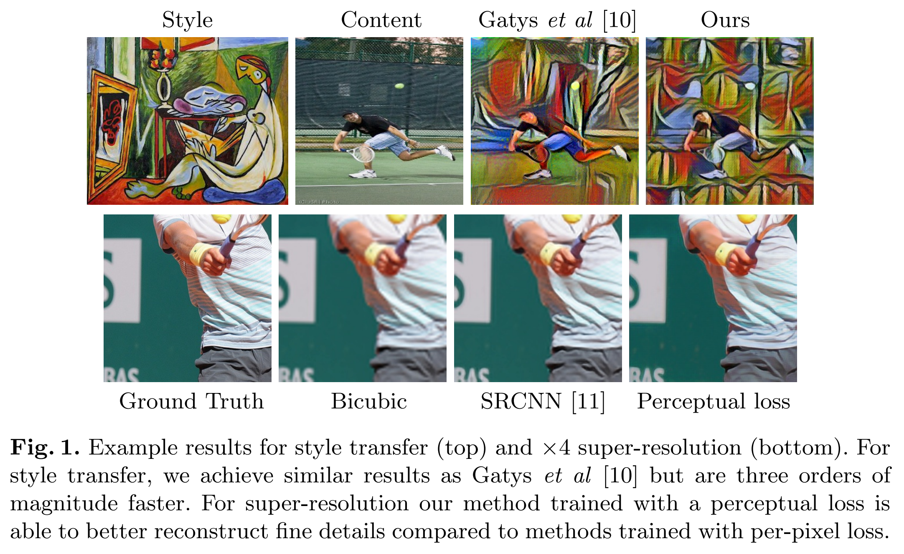
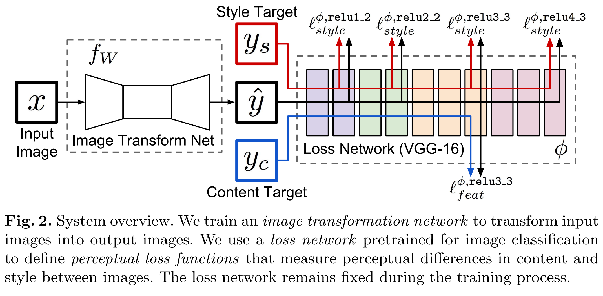
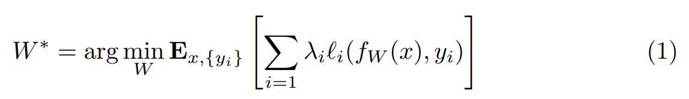

# Perceptual Losses for Real-Time Style Transfer and Super-Resolution(Perceptual Loss)  

Perceptual Loss는 2016년 Stanford 대학교에서 발표한 논문으로 오래된 논문임에도 최근까지도 자주 사용되는 손실함수이다.  

## Abstract  

보통 Image transformation problem에서는 per-pixel loss를 주로 사용하여 GT 이미지와 생성된 이미지를 비교한다.  
논문은 Pre-trained 된 네트워크에서 추출한 high-level의 feature를 기반으로 기존 방식의 장점을 결합한 Perceptual Loss를 제안한다. 그리고 이에대한 최적화 문제를 해결하기위한 방법을 제시한다.  
기존의 Per-pixel Loss를 Perceptual Loss로 대체할 경우 Super-resolution에서 훨씬 보기좋은 결과를 얻을수 있다 한다.  

## 1 Introduction  

Image transformation은 Per-Pixel loss를 사용하여 출력 이미지와 실제 GT 이미지의 차이를 측정하는 Supervised learning을 통해 해결하곤 한다.  
그러나 Per-Pixel loss는 출력 이미지와 GT 이미지 사이의 Perceptual한 차이를 구분해내지 못하는 단점이 존재한다.  
예를 들어서 두 이미지사이에 1픽셀 씩 차이가 존재하면 (1칸씩 밀린다거나), 유사성에 대해서 판단하기가 힘들다.  

따라서 Pre-trained 된 CNN에서 추출된 High-level의 feature간의 차이를 기반으로 하는 손실함수를 사용해 고품질의 이미지를 생성하는 연구들이 진행되고 있다.

논문은 Style Transfer와 single-image Super-Resolutiond이라는 2가지 task에 대한 실험을 진행했다.  
하지만 Style Transfer의 경우 정답으로 정해진 label이 따로 없고, Super-Resolution은 하나의 저해상도 이미지가 만들수 있는 고해상도 이미지가 수없이 많기 때문에, 두 task가 성공하기 위해서는 의미론적인 추론(semantic reasoning)이 필요하다.  

Style Transfer는 색상과 질감은 크게 바뀌지만, 출력이 sementic하게 입력과 유사해야 하고, Super-Resolution은 모호한 저해상도 이미지에 대해서 디테일한 이미지를 추론해야 할 필요가 있다.  

기본적으로 두 task를 수행하는 각각의 모델은 의미론적 추론에 대해서 학습해야 하지만, Perceptual loss를 사용하면 처음부터 배울 필요가 없다.  추론 과정을 Perceptual Loss가 대체해주기 때문이다.  

그렇기 때문에 논문에서 제시한 방식의 결과물은 다른 모델들과 비슷하지만 속도가 3배 정도 더 빠르다고 한다. 특히 Super-Resolution task는 손실함수를 Perceptual Loss로 대체할 경우 x4, x8시 만족스러운 결과를 얻을수 있다.  

## 2 Related Work  

***Feed-forward image transformation.***  

근 몇년간은 DNN과 per-pixel loss를 이용한 image transformation 방식이 대세였다.  

***Perceptual Optimization.***  

최근의 논문들을 보면 CNN을 통해 만들어진 high-level feature를 통한 최적화 방식으로 고품질 이미지를 생성해 내고 있다.  

***Style Transfer.***  

Gatys et al은 feature reconstruction loss와 style reconstruction loss를 pre-trained 된 CNN에서 추출한 featured를 사용하여 Style Transfer를 수행하였다.  

***Image super-resolution.***  

Super Resolution은 오래전부터 연구되던 분야로 수많은 평가지표들이 개발되어왔다.  

## 3 Method  

  

위 그림처럼 논문에서 제안하는 네트워크는 두가지의 components를 가진다.  

    - image transformation network (fw)
    - loss network (Φ) (l1, l2, ..., lk까지 몇가지 손실함수를 가지고 있음)  

image transformation network는 Deep residual CNN으로 input image $x$에 대한 output image $\hat{y}$가 출력되는 구조로 이루어져있다.  
각각의 손실함수 li는 출력 이미지 $\hat{y}$와 $y_i$사이의 차이를 측정한다.  
또한 네트워크는 Stochastic Gradient Descent (SGD)를 사용하여 훈련하는데 이에대한 가중치 W는 다음과 같이 나타낼 수 있다.  

  

Per-Pixel loss의 단점 해결 및 Perceptual loss의 측정을 더 잘할수 있도록 몇가지 최적화 기법을 이용해봤는데, 이러한 기법들의 핵심은 **Pre-trained된 Classification CNN이 손실함수에서 측정하려는 Perceptual한 정보들을 인코딩 하는 방법을 이미 습득했다는 것이다.**  

따라서 본 논문에서는 pre-trained된 classification 네트워크 Φ를 손실함수에 이용했다고 한다.  
Φ에 사용하는 loss는 2가지 종류로 구분되어있다.  

    - feature reconstruction loss
    - style reconstruction loss  

수식에서 input image $x$에 대한 *content target* $y_c$와 *style target* $y_s$가 함께 주어진다.  

예를들면    
    - Style transfer task의 경우 content target $y_c$는 입력 이미지 $x$와 같고, 출력 이미지 $\hat{y}$는 $x = y_c$에 style $y_s$가 합쳐진 결과이다.  
    - Super-resolution task의 경우 style reconstruction loss는 쓰이지 않고, content target $y_c$는 GT 값이며 $x$는 low-resolution의 입력이미지이다.  

### 3.1 Image Transformation Networks  

image transformation network는 DCGAN 네트워크 아키텍쳐를 사용했다.  
네트워크에는 pooling layer를 사용하지 않고, stride와 fractionally stride를 사용했다.  

여기서 fractionally stride는 Transposed Convolution을 뜻한다. 크기를 키울수 있는 효과가 있으며 결과적으로 Upsampling과 비슷한 효과를 볼수 있다.  
>참고 (https://m.blog.naver.com/PostView.naver?isHttpsRedirect=true&blogId=laonple&logNo=221037627532)  

  

논문으로 다시 돌아와서, 네트워크는 ResNet의 5개의 Residual Block을 사용하여 구성했다.  
모든 non-Residual block은 spatial Batch Normalization과 ReLU를 수행하고, 출력 Layer에서는 pixel 값이 [0, 255] 사이의 값을 가지게 하기 위해서 thah 함수를 수행한다.  

(Spatial BN은 그냥 공간상 BN으로, pytorch의 BatchNorm2D와 같다. 그냥 BN으로 알아들을면 될 것 같다.)  

첫번째와 마지막 Layer는 9x9의 kernel을 사용하고, 나머지 Layer는 3x3의 kernel을 사용한다.  

**Inputs and Outputs**  

Style Transfer task에서 입력/출력 이미지는 3x256x256 사이즈를 가진다.  
Super-resolution task에서는 출력 high-resolution 이미지가 3x288x288 사이즈, upsampling factor f(배)에 따라서 입력 row-resolution 이미지는 3x288/fx288/f 사이즈를 가진다.  

또한 네트워크가 Fully Convolutional network이므로, 어떠한 resolution의 이미지라도 입력으로 받을 수 있다.  

**Downsampling and Upsampling**  

upsampling factor f에 대해서, $log_2f$의 Convolution layer와 몇가지의 Residual block, 1/2의 stride를 사용했다.  
또한 fixed upsampling보다 Fractionally-stride convolution을 사용하면 나머지 네트워크의 부분과 조화롭게 학습이 가능하다고한다.  