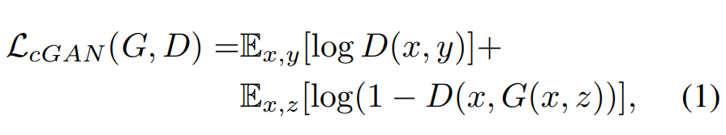
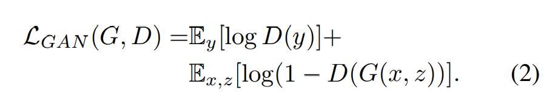
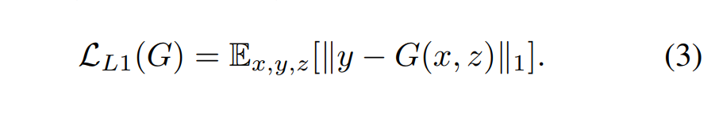
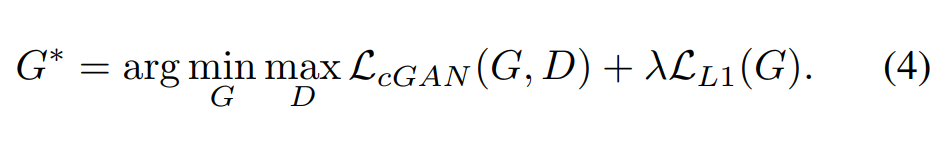
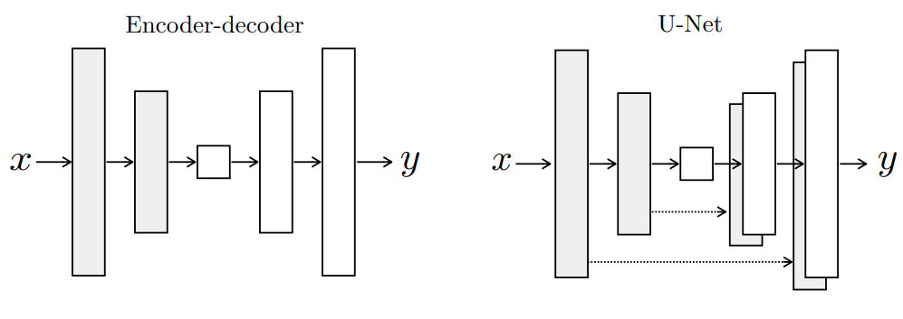

# image-to-Image Translation with Conditional Adversarial Networks(Pix2Pix)  

## Abstract  

image-to-image translation 문제에서 conditional adversarial network를 사용해보았다.  

(여기서 image-to-image translation이란?어떤 도메인의 이미지를 가져와서 다른 도메인에서 이미지의 특성을 가지도록 변환하는 작업 -> https://paperswithcode.com/task/image-to-image-translation)  

여기에서 입력이미지 -> 출력 이미지 간의 매핑을 학습할 뿐 아니라 이에대한 손실함수의 학습도 가능하다.  
이에따라 다양한 문제애 대해서 따로 손실 함수에 대한 설정을 수동적으로 해야 할 필요없이 좋은 결과를 얻을 수 있다는 것을 강조하고 있다.  

## 1 Introduction  

논문의 목적은 전체적으로 적용가능한 일반화된 프레임워크를 개발하는 것이라고 함.

CNN은 손실 함수를 최소화할 때 수동적으로 조절해줘야 하고 많은 자원을 낭비한다.  
그리고 Naive 하게 픽셀에 대한 Euclidean distance를 최소화 하도록 모델을 제작하면 흐릿한 결과를 생성하는 경향이 있다.  
만약에 출력물을 GT와 비슷하게 만들수 있는 손실 함수를 자동으로 학습이 가능하다면 좋을것이다. -> GAN  

CGAN(Conditional GAN)은 입력 이미지를 조건화 하고, 출력 이미지를 생성하는 image-to-image translation에 적합한 모델이다. 즉 광범위한 모델에 적합하다.  

요약하자면 CGAN을 통해 광범위한 image-to-image translation에 효과적이고 간단한 프레임워크를 제시하는 것이 이 논문의 목적이다.  

Pix2Pix 논문 저자의 코드(https://github.com/phillipi/pix2pix)  

## 2 Related work  

GAN 및 CGAN에 대한 내용이므로 생략  

## 3 Method  

### 3.1 Objective  

  
CGAN Loss를 설명하는 공식인데 조금 햇갈리게 써놨다.  
y가 GT인 real image이고 z가 random noize vector, x는 CGAN의 조건에 해당한다. (CGAN의 원 논문의 y가 x로 되어있다..)  

또한 Unconditional한 경우를 고려하는 Loss의 공식도 설명했다.  
  

여기서 GAN loss는 L2 distance와 같은 전통적 손실함수들과 혼합하는 편이 더 효과적이다. 왜냐하면, Generator의 목적은 오로지 Discrimonator를 속이는 것이기 때문에 (Loss 값을 minimize) 실제 이미지와 직접 distance를 비교해주는 loss와 혼합해주는 편이 좋다.  
논문에서는 L2에 비해 L1을 사용하는 편이 덜 흐려져 L1을 사용했다고 한다.  
  

그렇게 만들어진 최종 Loss Function은 다음과 같다.  
  

또한 이전의 GAN에서는 Gaussian Noise Z를 넣었던 것에 반해, 오히려 Noise를 무시하는 방향으로 학습하기 때문에 Z를 넣지 않았다고 한다.  

대신 train 및 test 시 생성자의 몇몇 layer에 dropout을 넣어줌으로서 노이즈를 제공해 줬다.  

### 3.2 Network architectures  

DCGAN과 같이, Generator와 Discriminator에 Convolution-BatchNorm-ReLU의 구조를 사용했다고 한다.  

#### 3.2.1 Generator with skips  

image-to-image translation에서는 큰 이미지를 입력 받아 큰 이미지로 출력한다. 입력과 츨력의 표면은 바르지만, 기본 구조는 같다.  
이 점을 고려해서 generator를 설계할 때, encoder-decoder의 구조를 흔히 사용한다.  
근데 이런 구조는 Bottleneck layer를 통과하며 downsampling 하기 때문에 정보가 손실된다.  
이런 병목현상을 해소하기 위해 skip-connection을 추가한 U-Net 구조를 Generator에 사용했다.  
  

#### 3.2.2 Markovian discriminator (PatchGAN)  

L1, L2 Loss는 고차원의 특성을 살리지 못하여 이미지를 흐리게 한다. 그러나 저차원에 대한 특성은 잘 포착한다고 한다.  
즉 GAN Discriminator는 고차원 특성을 뽑고, L1 Loss를 통해 저차원 특성을 뽑아내주는 구조를 생각했다.   
이를 위해 Discriminator를 PatchGAN에서 뽑아왔다. PatchGAN은 이미지를 각 Patch로 쪼개서 진짜인지 가짜인지를 구별하는데 세세한 특징을 (고수준의) 이미지에서 잡아낼 수 있다.  

그리고 이를 통해 더 작은 이미지를 집어넣게 됨으로(Patch), 파라미터가 더 작고 더빠르고 큰 이미지에도 적용할 수도 있다.  

### 3.3. Optimization and inference  

Discriminator 한번, Generator 한번 번갈아 가면서 학습한다.  

# Pix2Pix 코드 분석 (Pytorch)  

## Generator (Unet + Skip connection)  

``` python  
class UNetGenerator(nn.Module):
    def __init__(self, image_channels=3, inner_channels=64, n_layers=8, dropout=0.5, norm_layer=nn.InstanceNorm2d):
        super().__init__()
        assert n_layers >= 5

        block = UNetSkipConnectionBlock(inner_channels*8, inner_channels*8, 'innermost', norm_layer=norm_layer)
        for _ in range(n_layers-5):
            block = UNetSkipConnectionBlock(inner_channels*8, inner_channels*8, 'middle', block, dropout, norm_layer=norm_layer)
        block = UNetSkipConnectionBlock(inner_channels*4, inner_channels*8, 'middle', block, dropout, norm_layer=norm_layer)
        block = UNetSkipConnectionBlock(inner_channels*2, inner_channels*4, 'middle', block, dropout, norm_layer=norm_layer)
        block = UNetSkipConnectionBlock(inner_channels, inner_channels*2, 'middle', block, dropout, norm_layer=norm_layer)
        self.model = UNetSkipConnectionBlock(image_channels, inner_channels, 'outermost', block)

    def forward(self, x):
        return self.model(x)


class UNetSkipConnectionBlock(nn.Module):
    def __init__(self,
                 outer_channels,
                 inner_channels,
                 module_type,
                 submodule=None,
                 dropout=0.5,
                 norm_layer=nn.InstanceNorm2d
                 ):
        super().__init__()
        
        if module_type not in ['innermost', 'outermost', 'middle']:
            raise Exception('no such module type')

        if type(norm_layer) == functools.partial:
            use_bias = norm_layer.func == nn.InstanceNorm2d
        else:
            use_bias = norm_layer == nn.InstanceNorm2d
        
        down_conv = nn.Conv2d(outer_channels, inner_channels, kernel_size=4, stride=2, padding=1, bias=use_bias)
        down_relu = nn.LeakyReLU(0.2, True)
        down_norm = norm_layer(inner_channels)

        up_relu = nn.ReLU(True)
        up_norm = norm_layer(outer_channels)

        self.outermost = module_type == 'outermost'
        if module_type == 'innermost':
            up_conv = nn.ConvTranspose2d(inner_channels, outer_channels, kernel_size=4, stride=2, padding=1, bias=use_bias)
            modules = [down_relu, down_conv, up_relu, up_conv, up_norm]
        elif module_type == 'outermost':
            up_conv = nn.ConvTranspose2d(inner_channels*2, outer_channels, kernel_size=4, stride=2, padding=1)
            modules = [down_conv, submodule, up_relu, up_conv, nn.Tanh()]
        else:
            up_conv = nn.ConvTranspose2d(inner_channels*2, outer_channels, kernel_size=4, stride=2, padding=1, bias=use_bias)
            modules = [down_relu, down_conv, down_norm, submodule, up_relu, up_conv, up_norm, nn.Dropout(dropout)]

        self. model = nn.Sequential(*modules)

    def forward(self, x):
        if self.outermost:
            return self.model(x)
        return torch.cat([x, self.model(x)], 1)
```

## Discriminator  

```python  
class NLayerDiscriminator(nn.Module):
    def __init__(self,
                 input_channels=6,
                 inner_channels=64,
                 n_layers=3,
                 norm_layer=nn.InstanceNorm2d
                 ):
        super().__init__()

        if type(norm_layer) == functools.partial:
            use_bias = norm_layer.func == nn.InstanceNorm2d
        else:
            use_bias = norm_layer == nn.InstanceNorm2d

        modules = [nn.Conv2d(input_channels, inner_channels, kernel_size=4, stride=2, padding=1), nn.LeakyReLU(0.2, True)]
        for i in range(n_layers-1):
            modules += [
                nn.Conv2d(inner_channels*min(2**i, 8), inner_channels*min(2**(i+1), 8), kernel_size=4, stride=2, padding=1, bias=use_bias),
                norm_layer(inner_channels*min(2**(i+1), 8)),
                nn.LeakyReLU(0.2, True)
            ]
        modules += [
            nn.Conv2d(inner_channels * min(2 ** (n_layers-1), 8), inner_channels * min(2 ** n_layers, 8), kernel_size=4, stride=1,
                      padding=1, bias=use_bias),
            norm_layer(inner_channels * min(2 ** n_layers, 8)),
            nn.LeakyReLU(0.2, True),
            nn.Conv2d(inner_channels * min(2 ** n_layers, 8), 1, kernel_size=4, stride=1, padding=1)
        ]
        self.model = nn.Sequential(*modules)

    def forward(self, x):
        return self.model(x)
```