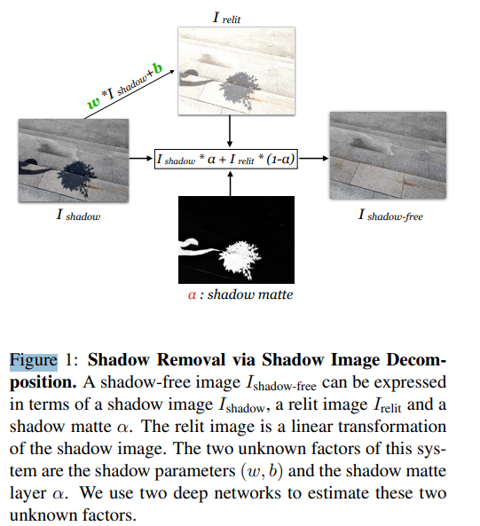

# Shadow Removal via Shadow Image Decomposition (SID)  

2019년 ICCV에서 제안된 그림자 제거 논문이다.  
(https://openaccess.thecvf.com/content_ICCV_2019/papers/Le_Shadow_Removal_via_Shadow_Image_Decomposition_ICCV_2019_paper.pdf)

## Abstract  

linear illumination transformation (선형 조명 변환)을 사용하여 shadow-free image, shadow parameter, matte layer를 조합하는 그림자 제거 방식을 제안한다.  
이를 위해서 SP-Net, M-Net이라는 2개의 모델을 통해 각각 shadow parameter와 shadow matte respectively(그림자 무광도)를 예측한다.  

이전의 ISTD dataset SOTA 모델과 비교할 때 무려 RMSE를 40%(13.3->7.9) 가량 감소시켰다.  
또한 shadow parameter를 수정하여 image decomposition system을 기반으로 ISTD dataset을 증강시켰다. (증강한 ISTD dataset을 통해 모델을 학습시키면 RMSE가 7.4로 더 낮아진다!!)  

## 1. Introduction  

그림자의 가장자리(edge)는 객체가 변화(여러물체에 그림자가 지는 등)하기 때문에 구별하기 어렵다. 그래서 그림자를 식별하고 제거하기위한 많은 연구들이 제안되었다.  

초기에는 source-occluder system을 통해 parameter를 측정해 그림자를 제거했지만 (물리적인 방식으로 그림자를 제거했다.) 이러한 방식은 상당한 시간과 자원을 필요로 하는 방식이였다.  

한편, 최근에는 방대한 양의 shadow dataset들이 탄생했기 때문에 그림자 제거에 딥러닝을 이용한 방식을 사용할 수 있게 되었다. 이러한 방식은 network가 shadow image를 shadow-free image로 mapping 하기위해 end-to-end 방식으로 훈련된다.  
그러나 딥러닝을 통한 그림자 제거는 물리적인 특성을 무시하기때문에, 그럴듯하게 그림자가 제거된다는 보장이 없다. 또한 결과가 blurry하고 자연스럽게 보이지 않는다.  
따라서 생성된 영상의 품질을 향상시키는 방법들이 활발히 연구되고 있다.  

**따라서 본 연구에서는 그림자의 조명과 딥러닝을 모두 활용하는 새로운 그림자 제거 방식을 제안한다.**  

제안한 illumination model(조명 모델)은 그림자 영역에 대한 scaling factor와 색상 채널당 추가 상수로 구성된 선형 변환이다. parameter 추정치를 통해 그림자를 제거하는데에 중요한 역할을 한다.  
  
  
이는 SP-Net 딥러닝 모델이 담당하는데, SP-Net은 그림자 이미지에서 illumination model parameter까지 mapping을 학습한다.  

또한 저자는 shadow matting 기술을 사용해 그림자의 음영 영역을 처리한다고 한다. illumination model을 image decomposition formulation에 통합하여, shadow image, parameter, shadow density matte (그림자 밀도 matte)를 조합하여 shadow-free image를 생성한다. (위의 그림과 같다.)  

또한 Shadow matte를 자동으로 정확하게 예측하기 위한 두번째 network인 M-Net을 제안한다.  

SP-Net만으로도 ISTD dataset의 RMSE를 13.3->9.5로 낮추었고 M-Net을0 추가한 경우 7.9까지 낮아졌다.  
이같은 성능은 현실적인 그림자 제거 방식에 의해서 가능하다. 먼저 이미지의 shadow parameter와 shadow matte를 추정하고, 추정된 parameter 값을 통해 shadow-free 이미지에 그림자를 추가한다. parameter 값을 변경시 그림자의 효과도 변화한다. 이를 통해 train data를 증강시킬 수 있다.  

이렇게 증강시킨 ISTD dataset을 이용하면, 이전보다 RMSE가 6% 가량 더 낮아진다.  
요약하자면 다음과 같다.  

    - 단순화된 물리적인 illumination model & image decomposition formulation을 통해 그림자 제거에 대한 새로운 접근법을 제시

    - 단순화된 물리적인 illumination model & image decomposi
    tion formulation을 기반으로 그림자 증강 방법을 제시  

    - 제안한 방법은 ISTD dataset에서 SOTA의 결과를 달성함  

## 2. Related Works  

(생략)  

## 3. Shadow and Image Decomposition Model  

### 3.1. Shadow Illumination Model  

Shadow Illumination model이란?  

mapping 함수인 T를 통해 shadow pixel $I_x^{shadow}$를 non-shadow pixel로 변환한다.  

$I_x^{shadow-free}(\lambda)=L_x^d(\lambda)R_x(\lambda)+L_x^a(\lambda)R_x(\lambda)$ (1)  

$I_x^{shadow-free}(\lambda)$는 x지점에서 반사되는 파장 $\lambda$의 강도이고, L과 R은 각각 Illumination(조명)과 reflectance respectively(반사율)이며, $L^d$는 직접조명, $L^a$은 주변부 조명이다.  
점 x에 그림자를 생성하기 위해서 Occluder 직접 조명과 차단하지 않으면 x에 영향을 주는 주변부 조명의 일부를 차단한다.  

x에 대한 수식은 다음과 같다.  

$I_x^{shadow}(\lambda)=a_x(\lambda)L_x^a(\lambda)R_x(\lambda)$ (2)  

$a_x(\lambda)$는 파장 $\lambda$에서 x에 도달하는 주변부 조명의 나머지 부분에 대한 attenuation factor(감쇠 계수)를 의미한다.  
(1), (2)의 수식을 통해 shadow-free pixel을 shadow pixel의 선형 함수로 나타낼 수 있게 된다.  

$I_x^{shadow-free}(\lambda)=L_x^d(\lambda)R_x(\lambda)+a_x(\lambda)^{-1}I_x^{shadow}(\lambda)$ (3)  

카메라로 사진을 촬영했을 때 전반적인 전처리 과정에서 이같은 선형 함수가 유지되므로 밝은 픽셀 x의 색에 대한 강도를 그림자 값의 선형함수로 표현이 가능하다.  

$I_x^{shadow-free}(k) = w_k \times I_x^{shadow}(k) + b_k$ (4)  

$I_x(k)$는 color channel k (RGB color channel에 속해 있는 channel중 하나)로 이미지 I의 픽셀 x의 값을 나타낸다.  
$b_k$는 직접 조명에 대한 카메라가 인식한 값, $w_k$는 한 color channel 안에 있는 한 pixel에 대한 주번부 조명의 attenuation factor를 의미한다.  

또한 논문은 그림자로 가려진 부분의 소재의 특성을 잘 표현하기 위해서 각 color channel을 독립적으로 모델링한다고 설명했다.  

