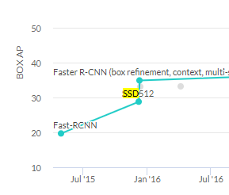
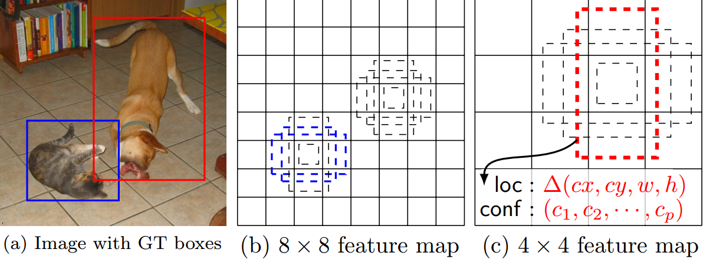

# SSD: Single Shot MultiBox Detector

## 1. Intrduction

최근 Object detection 시스템은 기본적으로 다음과 같은 과정을 변형하여 사용되곤 했다.

    - Bonding Box 특정
    - 각 Bonding Box에 대한 픽셀이나 특징을 리샘플링
    - 고품질의 Classifier에 집어넣음

성능은 좋지만 계산이 너무 복잡하고 좋은 하드웨어가 필요하며 시간이 오래걸렸다.  
그러다보니 제일 빠른 모델의 경우에도 7FPS 밖에 안나오는 등 문제가 생김.  

논문에서 제시하는 모델은 bounding box를 특정하거나 픽셀 re-sampling을 하지 않고 Object tetection이 가능한 첫번째 모델이라고한다. (그러면서도 높은 정확도를 가지고있다.)  
이 때문에 모델의 속도를 크게 증가시킬 수 있었다.  

또한 bounding boox의 위치를 예측하기위해 작은 conv filter를 사용했고 다양한 비율의 탐지를위해 별도의 예측 filter를 사용하여 성능을 개선시킬수 있었다.
이 filter들은 multiple scale의 Detection에 사용하기 위해 네트워크의 뒷쪽 layer의 multiple feature map에 적용시켰다.  

이 같은 과정을 통해 낮은 해상도의 input으로도 좋은 성능을 낼수 있었고, 빠르기까지 했다. 특히 다양한 scale의 예측의 경우 더 그렇다.)  

## 2. The Single Shot Detector (SSD)

**Fig. 1: SSD framework**  

  

SSD는 훈련 할 때 input image와 GT box만 있으면 된다.  
convolutional 방식에서 다른 크기의(4x4 그리고 8x8) feature map의 각 위치에 다른 비율의 default box set으로 평가한다. 각 default box에서 shape offset과 모든 object 카테고리에대한 confidence를 예측한다.  
학습 시에 default box와 ground truth box를 먼저 매칭한다.  

### 2.1 Model  
SSD는 NMS(non maximum suppression)를 거쳐 최종적으로 나오는 bbox와 score를 포함한 box들을 생각하는 feed-forward convolutional network(FFCNN)를 기반합니다.  