# Very Deep Convolutional Networks For Large-Scale Image Recognition  

> 참고 및 이미지 출처:  
- https://phil-baek.tistory.com/entry/1-Very-Deep-Convolutional-Networks-for-Large-Scale-Image-Recognition-VGGNet-%EB%85%BC%EB%AC%B8-%EB%A6%AC%EB%B7%B0  
- https://bskyvision.com/504  


## Abstract  

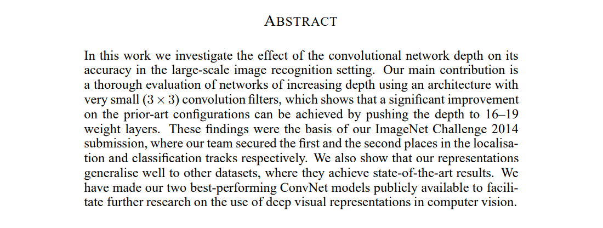  

연구팀은 **대규모 이미지 인식에 있어 CNN의 깊이가 정확도에 어떤 영향을 미치는지 조사했다.**  
VGGNet 연구팀은 3 x 3 Conv Filter를 여러갸 쌓아 기존 CNN 모델의 layer의 개수를 깊게 했고 대규모 이미지 인식에서 좋은 결과를 얻게 되었다.  


## 1 Introduction  

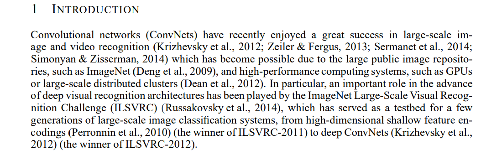  

CNN은 대규모 이미지와 비디오 인식에서 많이 써져왔다. 특히 ImageNet 등이 중요한 역할을 해 줬다.  

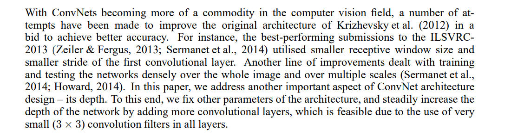  

정확도를 높이기 위한 여러 시도들이 있었다.  
ConvNEt 아케텍쳐 설계에 또다른 중요한 측면이 있는데 **그것이 바로 depth다.**  
이를위해서 많은 계층을 추가해 네트워크의 depth를 꾸준히 증가시켰고 이것은 모든 계층에서 **(3x3)의 매우 작은 필터를 사용**하기 때문에 가능했다고 한다.  

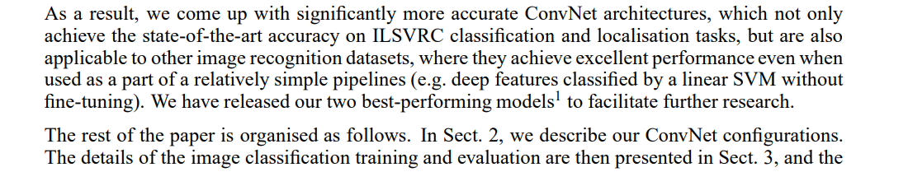  
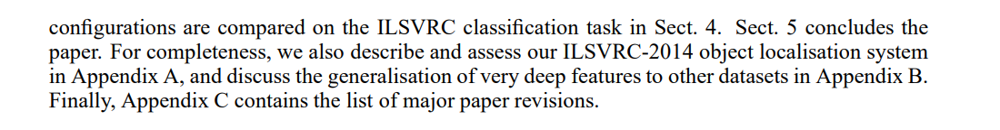  

결과적으로 훤씬더 정확한 CNN 아키텍쳐를 고안했고 성능이 가장 뛰어난 두 가지의 모델을 출시했다.  

여기서부터는 본문의 목차에 대한 요약이다.  

```
    * Sect 2: VGGNet 구조 설명
    * Sect 3: Training & Evaluation 방법 세부사항 설명  
    * Sect 4: ILSVRX 분류작업을 대상으로 모델의 각 구조에 대해 비교 분석  
    * Sect 5: 결론  
```

## 2 ConvNet Configurations  

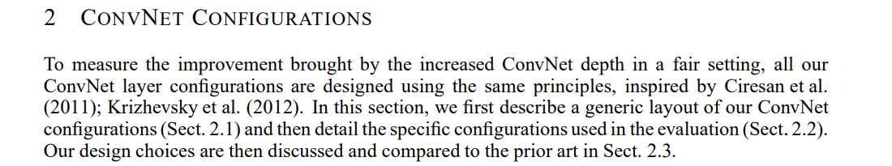  

### Sect 2의 목차  

```
    * 2.1: ConvNet 구성  
    * 2.2: 배열  
    * 2.3: 추가 설명  
```
### 2.1 Architecture  

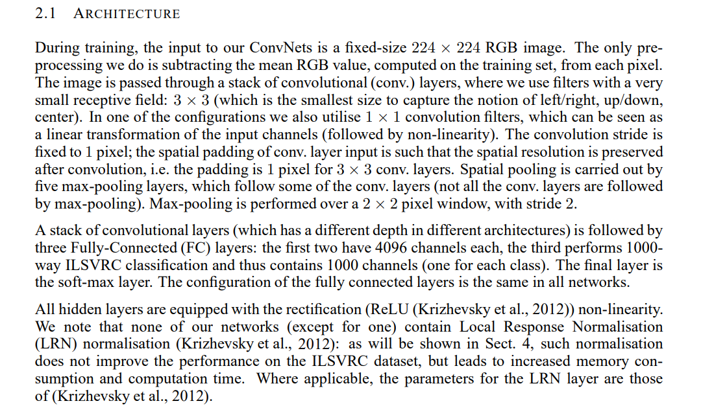  

VGGNet의 구조에 대한 요약을 하자면 다음과 같다.  

**Input Image**  

    - 224 x 224 RGB  
    - 전처리는 RGB 평균값 빼주는 것만 적용  

**Conv layer**  

    - 3 x 3 Conv filter 사용 (3 x 3 사이즈를 사용하는 이유는 이 사이즈가 이미지 요소의 left, right, up, down 등을 파악할 수 있는 최소한의  
    receptive field 이기 때문이다.)  
    - 1 x 1 Conv filter도 사용하는데 차원을 줄이고 nin-linearity를 증가시키기 위함이다.  
    - stride는 1, padding또한 1로 설정

```
잠깐 복습  

    - filter: 입력데이터를 지정된 간격으로 순회하며 채널별로 합성곱을 하여 그 합을 Feature Map으로 만들때 사용하는 크기  
    - Stride: filter를 지정된 간격만큼 띄어서 순회하는데 그 간격을 뜻함
    - padding: filter와 stride의 작용으로 feature map의 크기는 입력 데이터보다 작다. 그래서 층이 진행될 수록 데이터가 작아지다 결국  
    소멸할 수 있기 때문에, 이를 방지하기 위해 입력 데이터 외각에 지정된 픽셀만큼 특정 값으로 채워넣어 크기를 키우는 것을 padding이라 한다.  
    보통 padding 값으로 0을 넣는다.  
    - Pooling: 출력 데이터를 입력으로 받아 출력 데이터의 크기를 줄이거나 특정 데이터를 강조할 때 사용. Max pooling은 filter 값중  
    가장 큰 값을, Average pooling은 값의 평균을 출력한다.  
```

**Pooling layer**  

    - Conv layer 다음에 적용, 총 5개의 max pooling layer로 구성된다. (모든 구간을 통틀어서 5개인거지 5개 연속인게 아니다!!)  
    - 2 x 2 사이즈, stride는 2이다.  

**FC layer**  

    - 처음 두 FC layer는 4,096 채널
    - 마지막 FC layer는 1,000 채널

마지막으로 **soft-max layer** 적용해준다.  

```
FC layer란?  
fc layer: fully connected layer, 말그대로 모든 뉴런들이 이어진 형태를 가진 층을 의미한다.  
```

그외 모든 layer에서 ReLU를 사용한다.  
AlexNet에서 사용된 **LRN 기법은 성능 개선은 없고 메모리 사용량만 늘어나기 때문에 사용하지 않는다.**

### 2.2 Configurations  

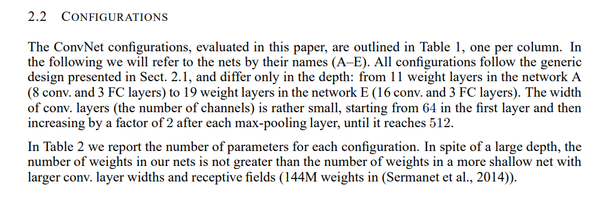  

ConvNet 구성은 표로 정리해 요약했다.  
depth에 따라 11 depth인 A구조 ~ 19 depth인 E 구조까지 있다.  
Conv layer의 폭(채널 수)은 64부터 시작해 max pooling layer를 통과할 때마다 2의 제곱만큼 커져서 최대 512만큼 커진다.  
depthsms smfdjskTwlaks **더 큰 conv layer를 사용한 앝은 신경망보다 파라미터 수가 줄어들었다고** 한다.  

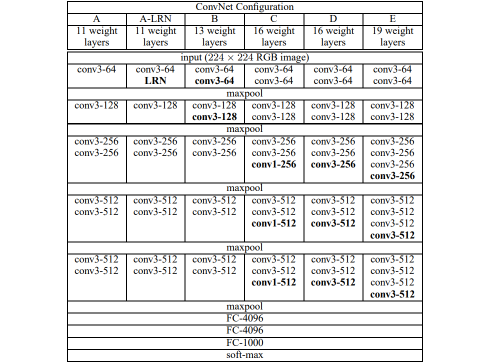  

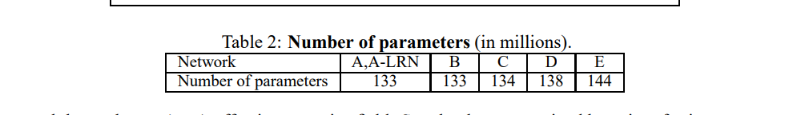  

### 2.3 Discussion  

#### 1개의 큰 filter를 사용하지 않고 3 x 3 filter를 여러개 사용하는 이유  

5 x 5 filter 한개와 3 x 3 filter 2개는 결과적으로 동일한 크기의 feature map을 생성하는데 왜 번거로운 작업을 했을까?  
이것은 작은 사이즈로 여러번 나눠 적용시 **layer를 거칠 때마다 ReLu도 더 많이 통과하게 되어 non-linear 한 의사결정을 더 잘하게 된다고 한다.**  
또한 7 x 7 1개보다 3 x 3 3개가 **paraneter 수가 줄어든다. 즉 오버피팅을 줄이는 효과가 있다.**  
C의 구조에서는 1 x1 conv를 두어 좀더 non-linear한 성격을 강화시켰다고 한다.  

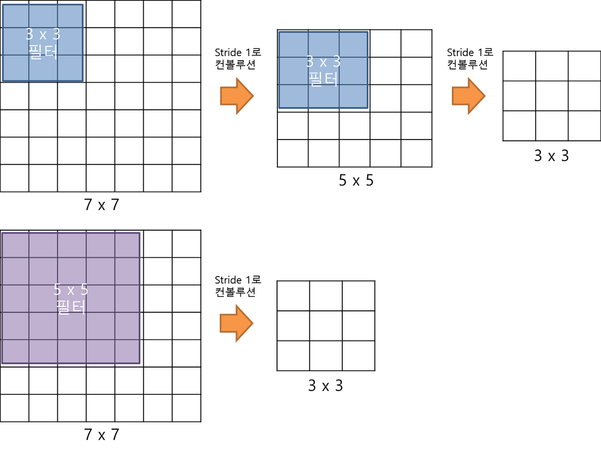  

## 3 Classification Framework  
  
크게 Training과 Testing으로 나누어 설명한다.  

### 3.1 training  

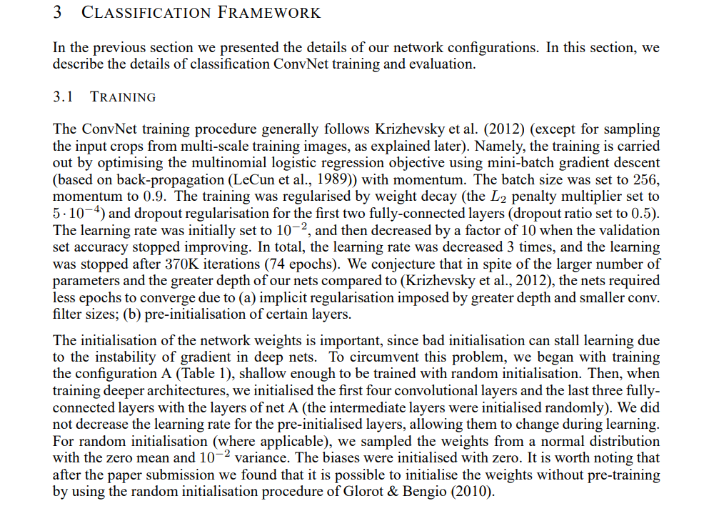  

우선 Training 부분은 하이퍼 파라미터를 어떻게 설정했는지부터 설명한다.  

**Cost Function**  
    - Multinomial logistic regression objective = Cross Entropy (교차 엔트로피)  

**Mini batch**  
    - 256 Size  

**Optimizer**  
    - Momentum = 0.9  

**Regularization**  
    - L2 = 5.10^-4  
    - Dropout = 0.5  

> Regularization이란?: https://m.blog.naver.com/laonple/220527647084  

**Learning rate**  
    - 10^-2 (Validation error rate가 높아질수록 10^-1씩 감소한다.)  

여기서 **AlexNet보다 더 깊고 parameter도 더 많지만, 더 적은 epoch을 기록**했는데 이는 다음 2가지 덕분이다.  

    1. Implicit regularisation  
        앞서 말한 필커의 크기를 줄이고 여러개를 사용한 덕분

    2. Pre-initialization  
        A 모델에 먼저 학습 후 다음 모델 구성시 A 모델에 학습된 layer를 사용하여 최적의 초기값 설정  
        (A 모델의 처음 4개 layer + 마지막 3개의 FC layer)  

**Training image Size**  

  

모델 학습시 training image를 VGG 모델의 input size에 맞게 바꿔주는 과정이 필요함  
input size의 scale=S라고 할때,  
S가 224인경우 training image의 가로, 세로 중 더 작은 쪽을 224에 맞춰준다.  
그리고 원사이즈의 비율을 지켜 사이즈를 rescaling한다.  
이것을 **isotropically-rescaled**라고 한다.  
rescaled 된 이미지에서 random하게 224 x 224 size로 crop 하여 input size에 맞춘다.  

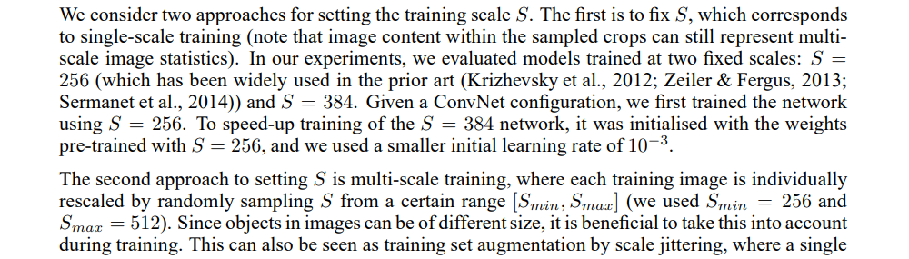  
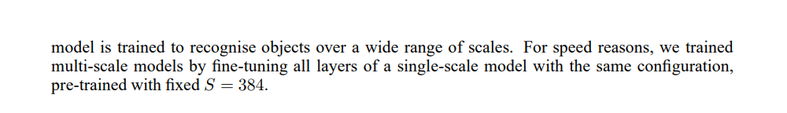  

여기서 S의 값을 설정하는데에는 두가지 방식이 있다.  

1. Single-scale training  

이 방식은 S를 256 or 384로 고정 하는 것인데 S가 384인 네트워크는 학습 속도를 높이기 위해 256으로 학습시킨 가중치를 기반으로 S를 384로 설정해 다시 학습시킨다.  
이미 학습이 어느정도 되어있기 때문에 384로 변경한 후에는 learning rate를 줄이고 학습한다.  

2. Multi-scale training  

이 방식은 S를 고정하지 않고 256~512에서 임의로 값을 설정한다.  
보통 이미지들은 모두 같은 사이즈가 아니기 때문에 random하게 multi-scale로 학습하면 학습 효과가 더 좋아진다. 이를 **Scale Jittering**이라고 한다.  
속도상의 이유로 S=384로 pre-trained 된 모델로 fine-tunung 시킨다.  

>fine tuning이란?: https://eehoeskrap.tistory.com/186  

### 3.2 testing  

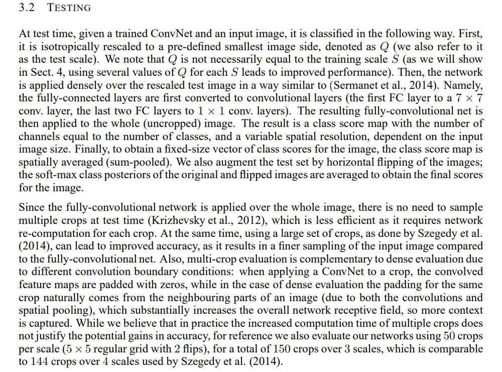  

테스트 시, ConvNet과 입력 이미지가 주어지면 다음 방식으로 분류된다.  

1. **training image를 rescle 하는 것처럼 test시에도 rescale한다.**  
rescale하는 scale을 Q라고 하는데 여기서 주목해야 할 것은 **S와 Q가 같은 필요가 없다는 것**이다.  
각각의 S값마다 다른 Q를 적용했을 때 VGG 모델의 성능이 좋아진다.  
(Validation set을 이용해 평가와 동시에 학습힌다고 한다.)  

2.  뒤 FC layer를 Conv layer로 변환한다. 첫번째 FC layer는 7 x 7 conv layer로, 마지막 두 개의 FC layer는 1 x 1 conv layer로 변환한다.  
**FC layer가 conv layer로 변경되었기 때문에 Test에서 uncropped image를 사용할 수 있게된다.**  
결과적으로 최종 output feature map size는 input image size에 의해서 결정된다. 이렇게 나온 feature map은 class score map이라고 부른다.  
이미지의 고정된 사이즈의 class score를 얻기 위해서 average pooling을 하고, softmax를 거친다음 flipped image와 original이미지의 평균 값을 통해 최종 score를 출력한다.  

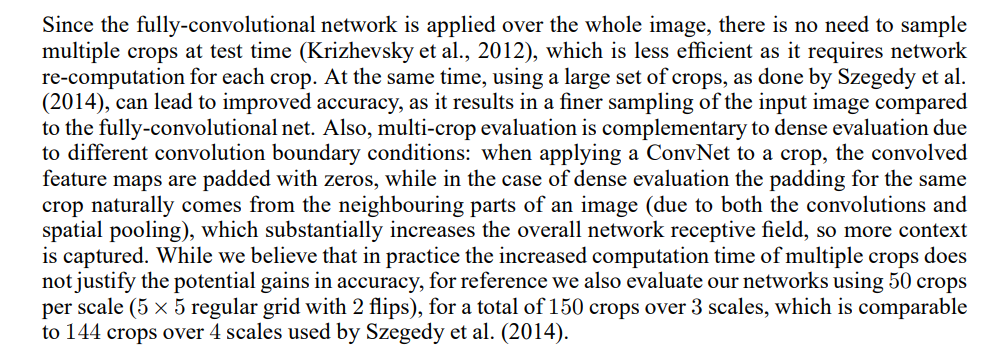  

Fully-conv network를 사용하여 test시 image를 crop할 필요가 없다. 
그리고 crop image를 input 데이터로 사용했다. 이 두가지 독분에 정확도가 향상될 수 있었다.  
최종적으로는 성능을 끌어올리기 위해 multi-crop 방식과 dense dvaluation 방식을 섞어서 사용했다.  

## 4 Classification Experiments

4장은 실험 결과에 대한 설명이다.  
