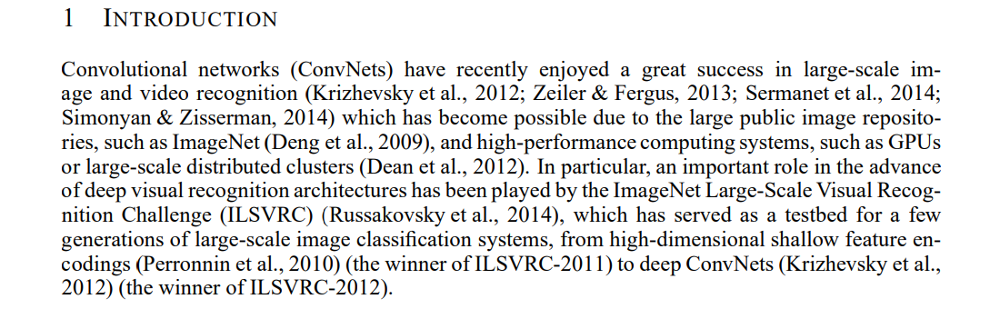
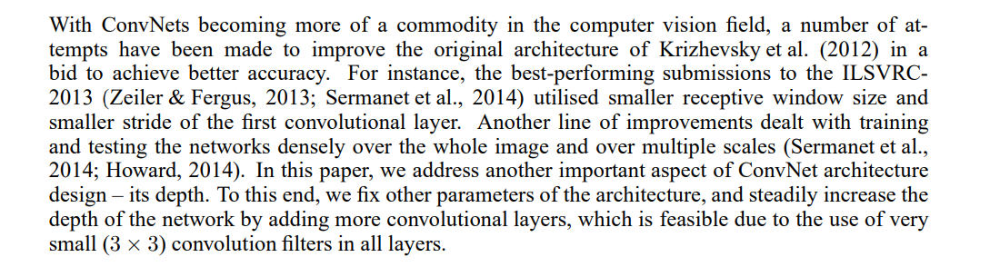
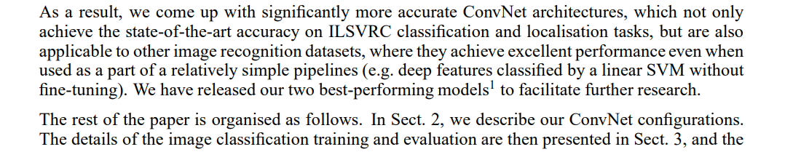
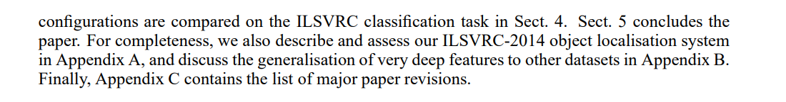
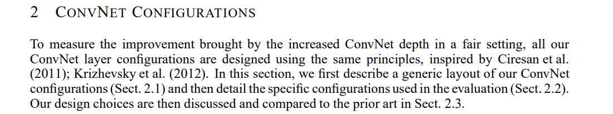
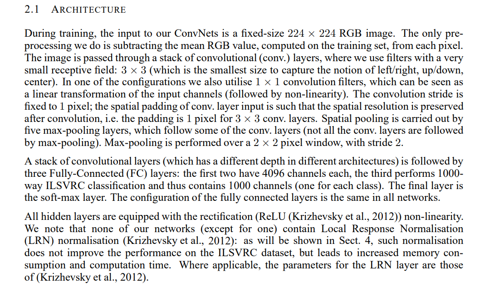

# Very Deep Convolutional Networks For Large-Scale Image Recognition  

참고: https://phil-baek.tistory.com/entry/1-Very-Deep-Convolutional-Networks-for-Large-Scale-Image-Recognition-VGGNet-%EB%85%BC%EB%AC%B8-%EB%A6%AC%EB%B7%B0  


## Abstract  

  

연구팀은 **대규모 이미지 인식에 있어 CNN의 깊이가 정확도에 어떤 영향을 미치는지 조사했다.**  
VGGNet 연구팀은 3 x 3 Conv Filter를 여러갸 쌓아 기존 CNN 모델의 layer의 개수를 깊게 했고 대규모 이미지 인식에서 좋은 결과를 얻게 되었다.  


## 1 Introduction  

  

CNN은 대규모 이미지와 비디오 인식에서 많이 써져왔다. 특히 ImageNet 등이 중요한 역할을 해 줬다.  

  

정확도를 높이기 위한 여러 시도들이 있었다.  
ConvNEt 아케텍쳐 설계에 또다른 중요한 측면이 있는데 **그것이 바로 depth다.**  
이를위해서 많은 계층을 추가해 네트워크의 depth를 꾸준히 증가시켰고 이것은 모든 계층에서 **(3x3)의 매우 작은 필터를 사용**하기 때문에 가능했다고 한다.  

  
  

결과적으로 훤씬더 정확한 CNN 아키텍쳐를 고안했고 성능이 가장 뛰어난 두 가지의 모델을 출시했다.  

여기서부터는 본문의 목차에 대한 요약이다.  

```
    * Sect 2: VGGNet 구조 설명
    * Sect 3: Training & Evaluation 방법 세부사항 설명  
    * Sect 4: ILSVRX 분류작업을 대상으로 모델의 각 구조에 대해 비교 분석  
    * Sect 5: 결론  
```

## 2 ConvNet Configurations  

  

### Sect 2의 목차  

```
    * 2.1: ConvNet 구성  
    * 2.2: 배열  
    * 2.3: 추가 설명  
```
### 2.1 Architecture  

  

VGGNet의 구조에 대한 요약을 하자면 다음과 같다.  

**Input Image**  

    - 224 x 224 RGB  
    - 전처리는 RGB 평균값 빼주는 것만 적용  

**Conv layer**  
